# PRESERV3D System - Swimlane Activity Diagrams

This document contains comprehensive swimlane activity diagrams for all key functions in the PRESERV3D system.

---

## Table of Contents

1. [User Registration & Authentication](#1-user-registration--authentication)
   - Student Registration
   - Faculty Registration
   - Visitor Registration
   - User Login
   - Admin Login
2. [PDF Document Upload & Processing](#2-pdf-document-upload--processing)
3. [3D Artifact Upload & Management](#3-3d-artifact-upload--management)
4. [Appointment Booking System](#4-appointment-booking-system)
5. [Admin Appointment Management](#5-admin-appointment-management)
6. [Visitor Registration Approval](#6-visitor-registration-approval)
7. [Super Admin User Management](#7-super-admin-user-management)
8. [Metadata Quality Validation](#8-metadata-quality-validation)
9. [Content Viewing & Interaction](#9-content-viewing--interaction)
10. [Collections Management](#10-collections-management)

---

## 1. User Registration & Authentication

### 1.1 Student Registration Flow

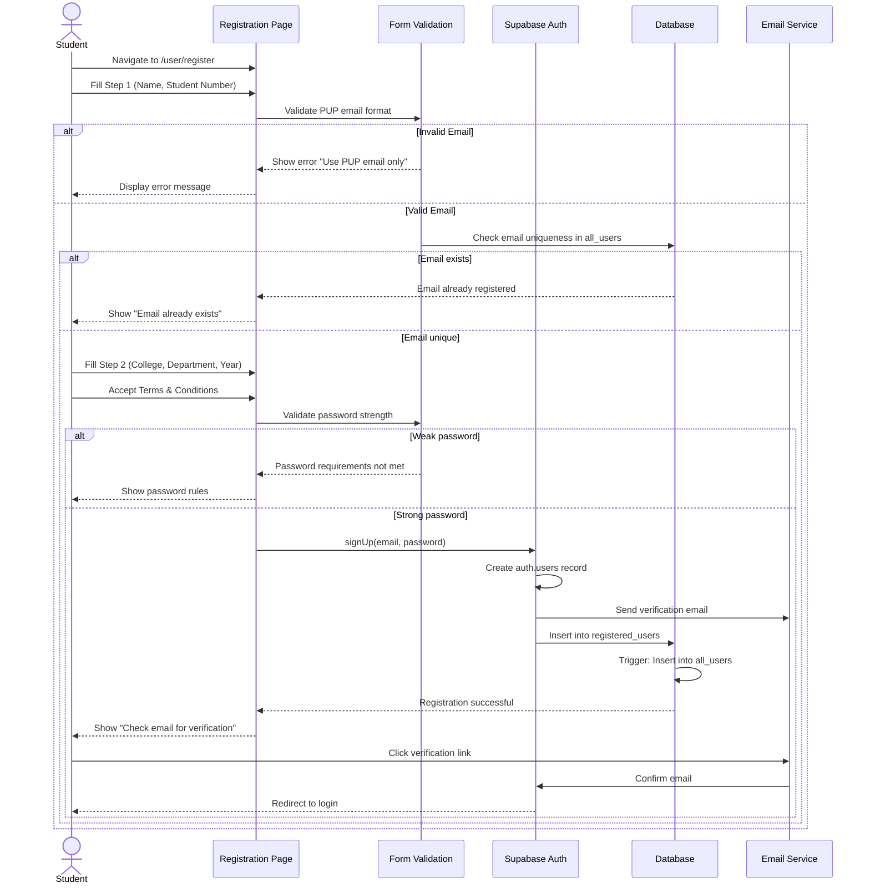
```mermaid
sequenceDiagram
    actor Student
    participant UI as Registration Page
    participant Validation as Form Validation
    participant Supabase as Supabase Auth
    participant DB as Database
    participant Email as Email Service

    Student->>UI: Navigate to /user/register
    Student->>UI: Fill Step 1 (Name, Student Number)
    UI->>Validation: Validate PUP email format
    
    alt Invalid Email
        Validation-->>UI: Show error "Use PUP email only"
        UI-->>Student: Display error message
    else Valid Email
        Validation->>DB: Check email uniqueness in all_users
        
        alt Email exists
            DB-->>UI: Email already registered
            UI-->>Student: Show "Email already exists"
        else Email unique
            Student->>UI: Fill Step 2 (College, Department, Year)
            Student->>UI: Accept Terms & Conditions
            UI->>Validation: Validate password strength
            
            alt Weak password
                Validation-->>UI: Password requirements not met
                UI-->>Student: Show password rules
            else Strong password
                UI->>Supabase: signUp(email, password)
                Supabase->>Supabase: Create auth.users record
                Supabase->>Email: Send verification email
                Supabase->>DB: Insert into registered_users
                DB->>DB: Trigger: Insert into all_users
                DB-->>UI: Registration successful
                UI-->>Student: Show "Check email for verification"
                Student->>Email: Click verification link
                Email->>Supabase: Confirm email
                Supabase-->>Student: Redirect to login
            end
        end
    end
```

### 1.2 Faculty Registration Flow

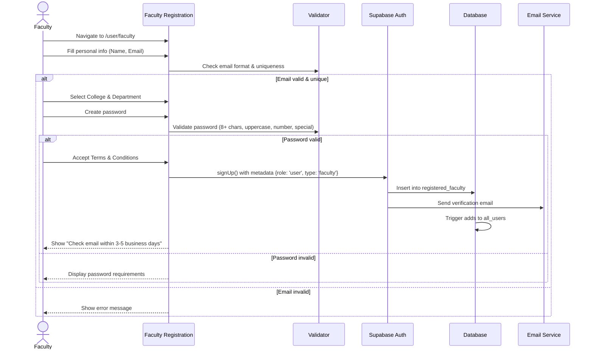
```mermaid
sequenceDiagram
    actor Faculty
    participant UI as Faculty Registration
    participant Validation as Validator
    participant Supabase as Supabase Auth
    participant DB as Database
    participant Email as Email Service

    Faculty->>UI: Navigate to /user/faculty
    Faculty->>UI: Fill personal info (Name, Email)
    UI->>Validation: Check email format & uniqueness
    
    alt Email valid & unique
        Faculty->>UI: Select College & Department
        Faculty->>UI: Create password
        UI->>Validation: Validate password (8+ chars, uppercase, number, special)
        
        alt Password valid
            Faculty->>UI: Accept Terms & Conditions
            UI->>Supabase: signUp() with metadata {role: 'user', type: 'faculty'}
            Supabase->>DB: Insert into registered_faculty
            Supabase->>Email: Send verification email
            DB->>DB: Trigger adds to all_users
            UI-->>Faculty: Show "Check email within 3-5 business days"
        else Password invalid
            UI-->>Faculty: Display password requirements
        end
    else Email invalid
        UI-->>Faculty: Show error message
    end
```

### 1.3 Visitor Registration Flow

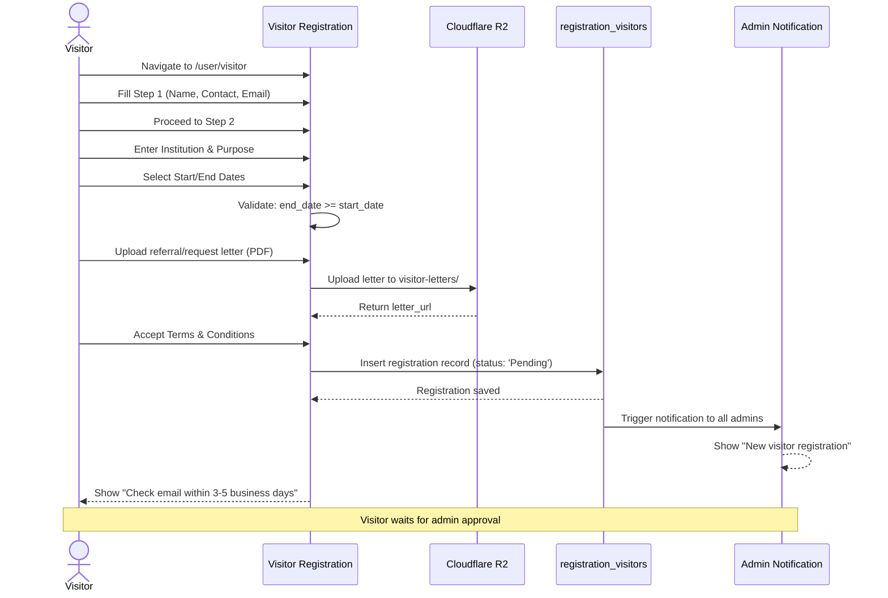
```mermaid
sequenceDiagram
    actor Visitor
    participant UI as Visitor Registration
    participant R2 as Cloudflare R2
    participant DB as registration_visitors
    participant Admin as Admin Notification

    Visitor->>UI: Navigate to /user/visitor
    Visitor->>UI: Fill Step 1 (Name, Contact, Email)
    Visitor->>UI: Proceed to Step 2
    
    Visitor->>UI: Enter Institution & Purpose
    Visitor->>UI: Select Start/End Dates
    
    UI->>UI: Validate: end_date >= start_date
    
    Visitor->>UI: Upload referral/request letter (PDF)
    UI->>R2: Upload letter to visitor-letters/
    R2-->>UI: Return letter_url
    
    Visitor->>UI: Accept Terms & Conditions
    UI->>DB: Insert registration record (status: 'Pending')
    DB-->>UI: Registration saved
    
    DB->>Admin: Trigger notification to all admins
    Admin-->>Admin: Show "New visitor registration"
    
    UI-->>Visitor: Show "Check email within 3-5 business days"
    
    Note over Visitor,Admin: Visitor waits for admin approval
```

### 1.4 User Login Flow

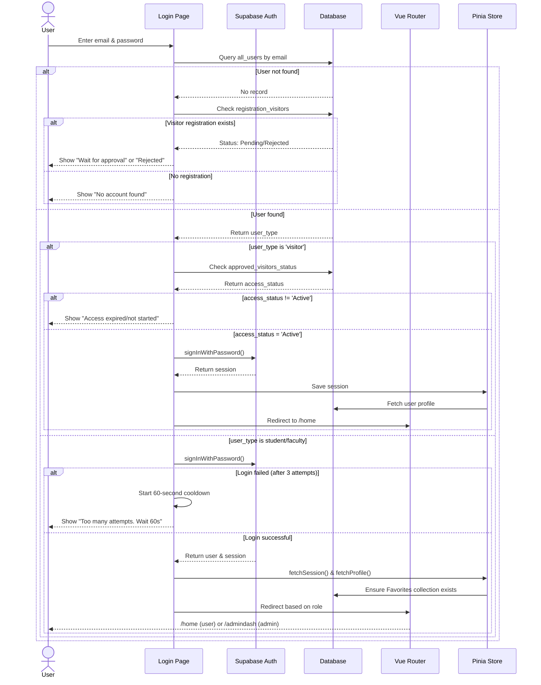
```mermaid
sequenceDiagram
    actor User
    participant UI as Login Page
    participant Supabase as Supabase Auth
    participant DB as Database
    participant Router as Vue Router
    participant Store as Pinia Store

    User->>UI: Enter email & password
    UI->>DB: Query all_users by email
    
    alt User not found
        DB-->>UI: No record
        UI->>DB: Check registration_visitors
        
        alt Visitor registration exists
            DB-->>UI: Status: Pending/Rejected
            UI-->>User: Show "Wait for approval" or "Rejected"
        else No registration
            UI-->>User: Show "No account found"
        end
    else User found
        DB-->>UI: Return user_type
        
        alt user_type is 'visitor'
            UI->>DB: Check approved_visitors_status
            DB-->>UI: Return access_status
            
            alt access_status != 'Active'
                UI-->>User: Show "Access expired/not started"
            else access_status = 'Active'
                UI->>Supabase: signInWithPassword()
                Supabase-->>UI: Return session
                UI->>Store: Save session
                Store->>DB: Fetch user profile
                UI->>Router: Redirect to /home
            end
        else user_type is student/faculty
            UI->>Supabase: signInWithPassword()
            
            alt Login failed (after 3 attempts)
                UI->>UI: Start 60-second cooldown
                UI-->>User: Show "Too many attempts. Wait 60s"
            else Login successful
                Supabase-->>UI: Return user & session
                UI->>Store: fetchSession() & fetchProfile()
                Store->>DB: Ensure Favorites collection exists
                UI->>Router: Redirect based on role
                Router-->>User: /home (user) or /admindash (admin)
            end
        end
    end
```

### 1.5 Admin Login Flow

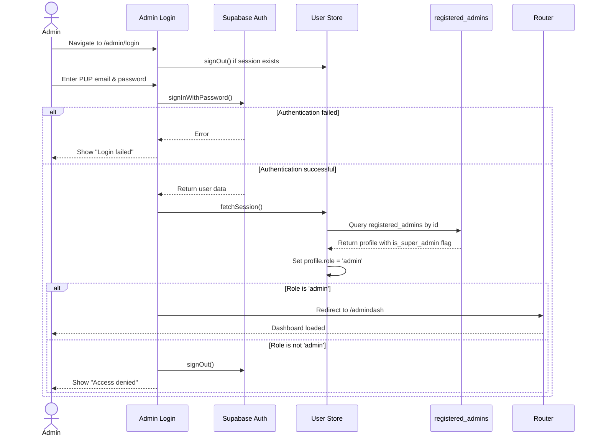
```mermaid
sequenceDiagram
    actor Admin
    participant UI as Admin Login
    participant Supabase as Supabase Auth
    participant Store as User Store
    participant DB as registered_admins
    participant Router as Router

    Admin->>UI: Navigate to /admin/login
    UI->>Store: signOut() if session exists
    
    Admin->>UI: Enter PUP email & password
    UI->>Supabase: signInWithPassword()
    
    alt Authentication failed
        Supabase-->>UI: Error
        UI-->>Admin: Show "Login failed"
    else Authentication successful
        Supabase-->>UI: Return user data
        UI->>Store: fetchSession()
        Store->>DB: Query registered_admins by id
        DB-->>Store: Return profile with is_super_admin flag
        Store->>Store: Set profile.role = 'admin'
        
        alt Role is 'admin'
            UI->>Router: Redirect to /admindash
            Router-->>Admin: Dashboard loaded
        else Role is not 'admin'
            UI->>Supabase: signOut()
            UI-->>Admin: Show "Access denied"
        end
    end
```

---

## 2. PDF Document Upload & Processing

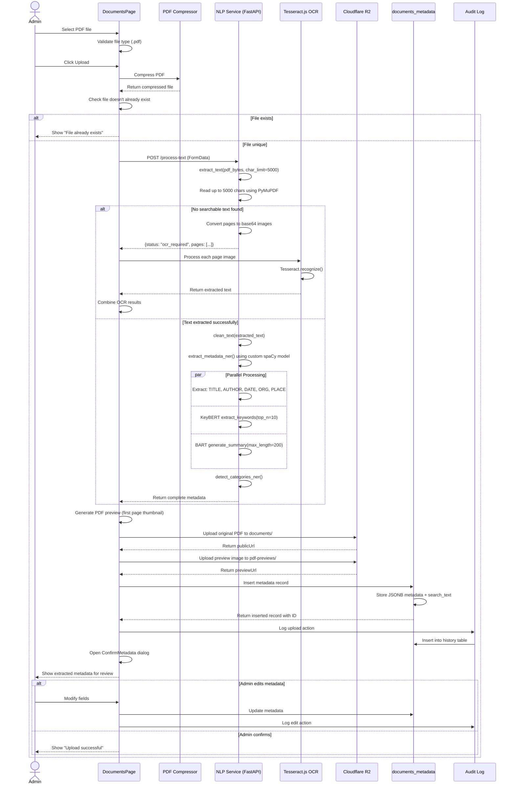
```mermaid
sequenceDiagram
    actor Admin
    participant UI as DocumentsPage
    participant Compressor as PDF Compressor
    participant NLP as NLP Service (FastAPI)
    participant OCR as Tesseract.js OCR
    participant R2 as Cloudflare R2
    participant DB as documents_metadata
    participant History as Audit Log

    Admin->>UI: Select PDF file
    UI->>UI: Validate file type (.pdf)
    Admin->>UI: Click Upload
    
    UI->>Compressor: Compress PDF
    Compressor-->>UI: Return compressed file
    
    UI->>UI: Check file doesn't already exist
    
    alt File exists
        UI-->>Admin: Show "File already exists"
    else File unique
        UI->>NLP: POST /process-text (FormData)
        NLP->>NLP: extract_text(pdf_bytes, char_limit=5000)
        NLP->>NLP: Read up to 5000 chars using PyMuPDF
        
        alt No searchable text found
            NLP->>NLP: Convert pages to base64 images
            NLP-->>UI: {status: "ocr_required", pages: [...]}
            UI->>OCR: Process each page image
            OCR->>OCR: Tesseract.recognize()
            OCR-->>UI: Return extracted text
            UI->>UI: Combine OCR results
        else Text extracted successfully
            NLP->>NLP: clean_text(extracted_text)
            NLP->>NLP: extract_metadata_ner() using custom spaCy model
            
            par Parallel Processing
                NLP->>NLP: Extract: TITLE, AUTHOR, DATE, ORG, PLACE
            and
                NLP->>NLP: KeyBERT extract_keywords(top_n=10)
            and
                NLP->>NLP: BART generate_summary(max_length=200)
            end
            
            NLP->>NLP: detect_categories_ner()
            NLP-->>UI: Return complete metadata
        end
        
        UI->>UI: Generate PDF preview (first page thumbnail)
        UI->>R2: Upload original PDF to documents/
        R2-->>UI: Return publicUrl
        
        UI->>R2: Upload preview image to pdf-previews/
        R2-->>UI: Return previewUrl
        
        UI->>DB: Insert metadata record
        DB->>DB: Store JSONB metadata + search_text
        DB-->>UI: Return inserted record with ID
        
        UI->>History: Log upload action
        History->>DB: Insert into history table
        
        UI->>UI: Open ConfirmMetadata dialog
        UI-->>Admin: Show extracted metadata for review
        
        alt Admin edits metadata
            Admin->>UI: Modify fields
            UI->>DB: Update metadata
            UI->>History: Log edit action
        else Admin confirms
            UI-->>Admin: Show "Upload successful"
        end
    end
```

---

## 3. 3D Artifact Upload & Management

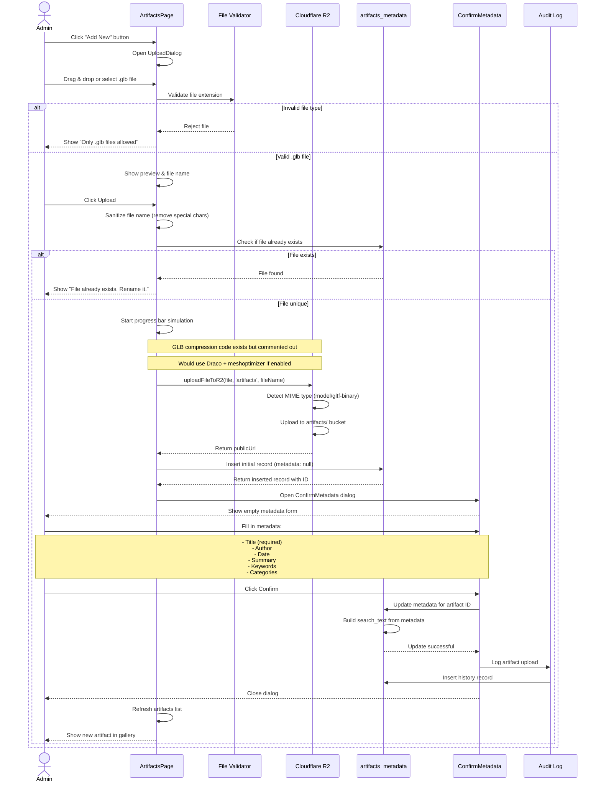
```mermaid
sequenceDiagram
    actor Admin
    participant UI as ArtifactsPage
    participant Validator as File Validator
    participant R2 as Cloudflare R2
    participant DB as artifacts_metadata
    participant Dialog as ConfirmMetadata
    participant History as Audit Log

    Admin->>UI: Click "Add New" button
    UI->>UI: Open UploadDialog
    
    Admin->>UI: Drag & drop or select .glb file
    UI->>Validator: Validate file extension
    
    alt Invalid file type
        Validator-->>UI: Reject file
        UI-->>Admin: Show "Only .glb files allowed"
    else Valid .glb file
        UI->>UI: Show preview & file name
        Admin->>UI: Click Upload
        
        UI->>UI: Sanitize file name (remove special chars)
        UI->>DB: Check if file already exists
        
        alt File exists
            DB-->>UI: File found
            UI-->>Admin: Show "File already exists. Rename it."
        else File unique
            UI->>UI: Start progress bar simulation
            
            Note over UI,R2: GLB compression code exists but commented out
            Note over UI,R2: Would use Draco + meshoptimizer if enabled
            
            UI->>R2: uploadFileToR2(file, 'artifacts', fileName)
            R2->>R2: Detect MIME type (model/gltf-binary)
            R2->>R2: Upload to artifacts/ bucket
            R2-->>UI: Return publicUrl
            
            UI->>DB: Insert initial record (metadata: null)
            DB-->>UI: Return inserted record with ID
            
            UI->>Dialog: Open ConfirmMetadata dialog
            Dialog-->>Admin: Show empty metadata form
            
            Admin->>Dialog: Fill in metadata:
            Note over Admin,Dialog: - Title (required)<br/>- Author<br/>- Date<br/>- Summary<br/>- Keywords<br/>- Categories
            
            Admin->>Dialog: Click Confirm
            Dialog->>DB: Update metadata for artifact ID
            DB->>DB: Build search_text from metadata
            DB-->>Dialog: Update successful
            
            Dialog->>History: Log artifact upload
            History->>DB: Insert history record
            
            Dialog-->>Admin: Close dialog
            UI->>UI: Refresh artifacts list
            UI-->>Admin: Show new artifact in gallery
        end
    end
```

---

## 4. Appointment Booking System

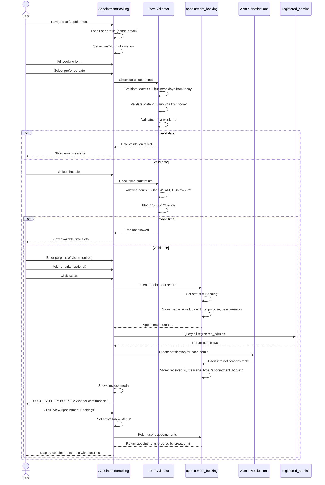
```mermaid
sequenceDiagram
    actor User
    participant UI as AppointmentBooking
    participant Validator as Form Validator
    participant DB as appointment_booking
    participant AdminNotif as Admin Notifications
    participant AdminDB as registered_admins

    User->>UI: Navigate to /appointment
    UI->>UI: Load user profile (name, email)
    UI->>UI: Set activeTab = 'information'
    
    User->>UI: Fill booking form
    User->>UI: Select preferred date
    
    UI->>Validator: Check date constraints
    Validator->>Validator: Validate: date >= 2 business days from today
    Validator->>Validator: Validate: date <= 3 months from today
    Validator->>Validator: Validate: not a weekend
    
    alt Invalid date
        Validator-->>UI: Date validation failed
        UI-->>User: Show error message
    else Valid date
        User->>UI: Select time slot
        
        UI->>Validator: Check time constraints
        Validator->>Validator: Allowed hours: 8:00-11:45 AM, 1:00-7:45 PM
        Validator->>Validator: Block: 12:00-12:59 PM
        
        alt Invalid time
            Validator-->>UI: Time not allowed
            UI-->>User: Show available time slots
        else Valid time
            User->>UI: Enter purpose of visit (required)
            User->>UI: Add remarks (optional)
            User->>UI: Click BOOK
            
            UI->>DB: Insert appointment record
            DB->>DB: Set status = 'Pending'
            DB->>DB: Store: name, email, date, time, purpose, user_remarks
            DB-->>UI: Appointment created
            
            UI->>AdminDB: Query all registered_admins
            AdminDB-->>UI: Return admin IDs
            
            UI->>AdminNotif: Create notification for each admin
            AdminNotif->>DB: Insert into notifications table
            DB->>DB: Store: receiver_id, message, type='appointment_booking'
            
            UI->>UI: Show success modal
            UI-->>User: "SUCCESSFULLY BOOKED! Wait for confirmation."
            
            User->>UI: Click "View Appointment Bookings"
            UI->>UI: Set activeTab = 'status'
            UI->>DB: Fetch user's appointments
            DB-->>UI: Return appointments ordered by created_at
            UI-->>User: Display appointments table with statuses
        end
    end
```

---

## 5. Admin Appointment Management

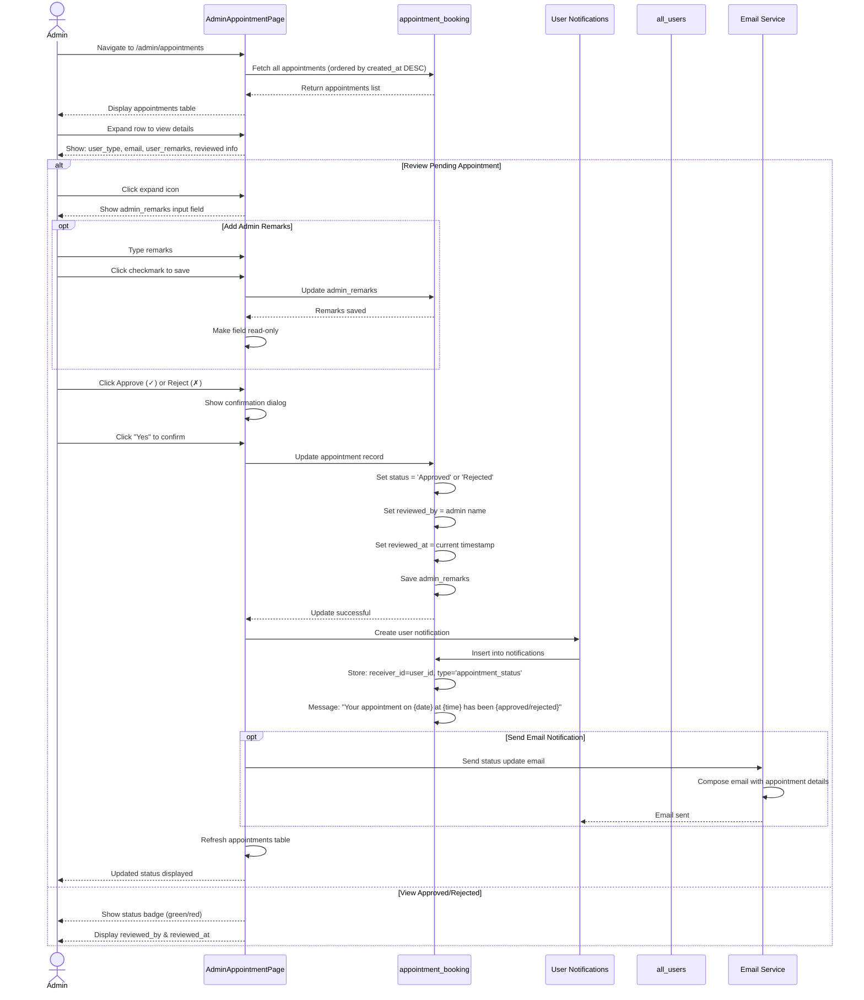
```mermaid
sequenceDiagram
    actor Admin
    participant UI as AdminAppointmentPage
    participant DB as appointment_booking
    participant UserNotif as User Notifications
    participant UserDB as all_users
    participant Email as Email Service

    Admin->>UI: Navigate to /admin/appointments
    UI->>DB: Fetch all appointments (ordered by created_at DESC)
    DB-->>UI: Return appointments list
    UI-->>Admin: Display appointments table
    
    Admin->>UI: Expand row to view details
    UI-->>Admin: Show: user_type, email, user_remarks, reviewed info
    
    alt Review Pending Appointment
        Admin->>UI: Click expand icon
        UI-->>Admin: Show admin_remarks input field
        
        opt Add Admin Remarks
            Admin->>UI: Type remarks
            Admin->>UI: Click checkmark to save
            UI->>DB: Update admin_remarks
            DB-->>UI: Remarks saved
            UI->>UI: Make field read-only
        end
        
        Admin->>UI: Click Approve (✓) or Reject (✗)
        UI->>UI: Show confirmation dialog
        Admin->>UI: Click "Yes" to confirm
        
        UI->>DB: Update appointment record
        DB->>DB: Set status = 'Approved' or 'Rejected'
        DB->>DB: Set reviewed_by = admin name
        DB->>DB: Set reviewed_at = current timestamp
        DB->>DB: Save admin_remarks
        DB-->>UI: Update successful
        
        UI->>UserNotif: Create user notification
        UserNotif->>DB: Insert into notifications
        DB->>DB: Store: receiver_id=user_id, type='appointment_status'
        DB->>DB: Message: "Your appointment on {date} at {time} has been {approved/rejected}"
        
        opt Send Email Notification
            UI->>Email: Send status update email
            Email->>Email: Compose email with appointment details
            Email-->>UserNotif: Email sent
        end
        
        UI->>UI: Refresh appointments table
        UI-->>Admin: Updated status displayed
    else View Approved/Rejected
        UI-->>Admin: Show status badge (green/red)
        UI-->>Admin: Display reviewed_by & reviewed_at
    end
```

---

## 6. Visitor Registration Approval

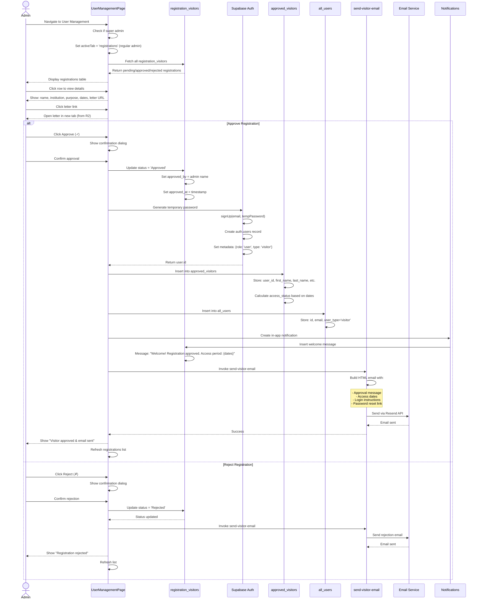
```mermaid
sequenceDiagram
    actor Admin
    participant UI as UserManagementPage
    participant DB as registration_visitors
    participant Supabase as Supabase Auth
    participant ApprovedDB as approved_visitors
    participant AllUsers as all_users
    participant EdgeFunc as send-visitor-email
    participant Email as Email Service
    participant Notif as Notifications

    Admin->>UI: Navigate to User Management
    UI->>UI: Check if super admin
    UI->>UI: Set activeTab = 'registrations' (regular admin)
    
    UI->>DB: Fetch all registration_visitors
    DB-->>UI: Return pending/approved/rejected registrations
    UI-->>Admin: Display registrations table
    
    Admin->>UI: Click row to view details
    UI-->>Admin: Show: name, institution, purpose, dates, letter URL
    
    Admin->>UI: Click letter link
    UI-->>Admin: Open letter in new tab (from R2)
    
    alt Approve Registration
        Admin->>UI: Click Approve (✓)
        UI->>UI: Show confirmation dialog
        Admin->>UI: Confirm approval
        
        UI->>DB: Update status = 'Approved'
        DB->>DB: Set approved_by = admin name
        DB->>DB: Set approved_at = timestamp
        
        UI->>Supabase: Generate temporary password
        Supabase->>Supabase: signUp(email, tempPassword)
        Supabase->>Supabase: Create auth.users record
        Supabase->>Supabase: Set metadata: {role: 'user', type: 'visitor'}
        Supabase-->>UI: Return user.id
        
        UI->>ApprovedDB: Insert into approved_visitors
        ApprovedDB->>ApprovedDB: Store: user_id, first_name, last_name, etc.
        ApprovedDB->>ApprovedDB: Calculate access_status based on dates
        
        UI->>AllUsers: Insert into all_users
        AllUsers->>AllUsers: Store: id, email, user_type='visitor'
        
        UI->>Notif: Create in-app notification
        Notif->>DB: Insert welcome message
        DB->>DB: Message: "Welcome! Registration approved. Access period: {dates}"
        
        UI->>EdgeFunc: Invoke send-visitor-email
        EdgeFunc->>EdgeFunc: Build HTML email with:
        Note over EdgeFunc: - Approval message<br/>- Access dates<br/>- Login instructions<br/>- Password reset link
        EdgeFunc->>Email: Send via Resend API
        Email-->>EdgeFunc: Email sent
        EdgeFunc-->>UI: Success
        
        UI-->>Admin: Show "Visitor approved & email sent"
        UI->>UI: Refresh registrations list
        
    else Reject Registration
        Admin->>UI: Click Reject (✗)
        UI->>UI: Show confirmation dialog
        Admin->>UI: Confirm rejection
        
        UI->>DB: Update status = 'Rejected'
        DB-->>UI: Status updated
        
        UI->>EdgeFunc: Invoke send-visitor-email
        EdgeFunc->>Email: Send rejection email
        Email-->>EdgeFunc: Email sent
        
        UI-->>Admin: Show "Registration rejected"
        UI->>UI: Refresh list
    end
```

---

## 7. Super Admin User Management

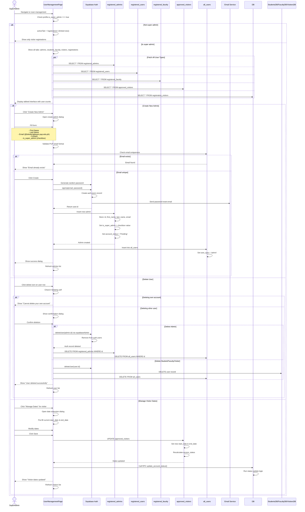
```mermaid
sequenceDiagram
    actor SuperAdmin
    participant UI as UserManagementPage
    participant Auth as Supabase Auth
    participant AdminDB as registered_admins
    participant StudentsDB as registered_users
    participant FacultyDB as registered_faculty
    participant VisitorsDB as approved_visitors
    participant AllUsers as all_users
    participant Email as Email Service

    SuperAdmin->>UI: Navigate to /user-management
    UI->>UI: Check profile.is_super_admin === true
    
    alt Not super admin
        UI->>UI: activeTab = 'registrations' (limited view)
        UI-->>SuperAdmin: Show only visitor registrations
    else Is super admin
        UI->>UI: Show all tabs: admins, students, faculty, visitors, registrations
        
        par Fetch All User Types
            UI->>AdminDB: SELECT * FROM registered_admins
        and
            UI->>StudentsDB: SELECT * FROM registered_users
        and
            UI->>FacultyDB: SELECT * FROM registered_faculty
        and
            UI->>VisitorsDB: SELECT * FROM approved_visitors
        and
            UI->>DB: SELECT * FROM registration_visitors
        end
        
        UI-->>SuperAdmin: Display tabbed interface with user counts
        
        alt Create New Admin
            SuperAdmin->>UI: Click "Create New Admin"
            UI->>UI: Open create admin dialog
            
            SuperAdmin->>UI: Fill form:
            Note over SuperAdmin,UI: - First Name<br/>- Last Name<br/>- Email (@iskolarngbayan.pup.edu.ph)<br/>- Contact<br/>- is_super_admin (checkbox)
            
            UI->>UI: Validate PUP email format
            UI->>AllUsers: Check email uniqueness
            
            alt Email exists
                AllUsers-->>UI: Email found
                UI-->>SuperAdmin: Show "Email already exists"
            else Email unique
                SuperAdmin->>UI: Click Create
                
                UI->>Auth: Generate random password
                UI->>Auth: signUp(email, password)
                Auth->>Auth: Create auth.users record
                Auth->>Email: Send password reset email
                Auth-->>UI: Return user.id
                
                UI->>AdminDB: Insert new admin
                AdminDB->>AdminDB: Store: id, first_name, last_name, email
                AdminDB->>AdminDB: Set is_super_admin = checkbox value
                AdminDB->>AdminDB: Set account_status = 'Pending'
                AdminDB-->>UI: Admin created
                
                UI->>AllUsers: Insert into all_users
                AllUsers->>AllUsers: Set user_type = 'admin'
                
                UI-->>SuperAdmin: Show success dialog
                UI->>UI: Refresh admins list
            end
            
        else Delete User
            SuperAdmin->>UI: Click delete icon on user row
            UI->>UI: Check if deleting self
            
            alt Deleting own account
                UI-->>SuperAdmin: Show "Cannot delete your own account"
            else Deleting other user
                UI->>UI: Show confirmation dialog
                SuperAdmin->>UI: Confirm deletion
                
                alt Delete Admin
                    UI->>Auth: deleteUser(admin.id) via supabaseAdmin
                    Auth->>Auth: Remove from auth.users
                    Auth-->>UI: Auth record deleted
                    
                    UI->>AdminDB: DELETE FROM registered_admins WHERE id
                    UI->>AllUsers: DELETE FROM all_users WHERE id
                    
                else Delete Student/Faculty/Visitor
                    UI->>Auth: deleteUser(user.id)
                    UI->>StudentsDB/FacultyDB/VisitorsDB: DELETE user record
                    UI->>AllUsers: DELETE FROM all_users
                end
                
                UI-->>SuperAdmin: Show "User deleted successfully"
                UI->>UI: Refresh user list
            end
            
        else Manage Visitor Dates
            SuperAdmin->>UI: Click "Manage Dates" for visitor
            UI->>UI: Open date extension dialog
            UI->>UI: Pre-fill current start_date & end_date
            
            SuperAdmin->>UI: Modify dates
            SuperAdmin->>UI: Click Save
            
            UI->>VisitorsDB: UPDATE approved_visitors
            VisitorsDB->>VisitorsDB: Set new start_date & end_date
            VisitorsDB->>VisitorsDB: Recalculate access_status
            VisitorsDB-->>UI: Dates updated
            
            UI->>DB: Call RPC update_account_status()
            DB->>DB: Run status update logic
            
            UI-->>SuperAdmin: Show "Visitor dates updated"
            UI->>UI: Refresh visitors list
        end
    end
```

---

## 8. Metadata Quality Validation

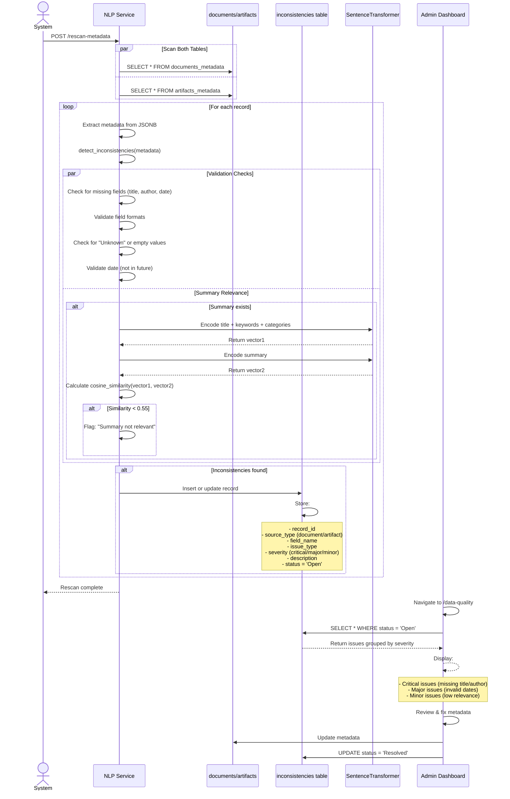
```mermaid
sequenceDiagram
    actor System
    participant NLP as NLP Service
    participant DB as documents/artifacts
    participant Inconsistencies as inconsistencies table
    participant SentenceT as SentenceTransformer
    participant Admin as Admin Dashboard

    System->>NLP: POST /rescan-metadata
    
    par Scan Both Tables
        NLP->>DB: SELECT * FROM documents_metadata
    and
        NLP->>DB: SELECT * FROM artifacts_metadata
    end
    
    loop For each record
        NLP->>NLP: Extract metadata from JSONB
        
        NLP->>NLP: detect_inconsistencies(metadata)
        
        par Validation Checks
            NLP->>NLP: Check for missing fields (title, author, date)
            NLP->>NLP: Validate field formats
            NLP->>NLP: Check for "Unknown" or empty values
            NLP->>NLP: Validate date (not in future)
        and Summary Relevance
            alt Summary exists
                NLP->>SentenceT: Encode title + keywords + categories
                SentenceT-->>NLP: Return vector1
                
                NLP->>SentenceT: Encode summary
                SentenceT-->>NLP: Return vector2
                
                NLP->>NLP: Calculate cosine_similarity(vector1, vector2)
                
                alt Similarity < 0.55
                    NLP->>NLP: Flag: "Summary not relevant"
                end
            end
        end
        
        alt Inconsistencies found
            NLP->>Inconsistencies: Insert or update record
            Inconsistencies->>Inconsistencies: Store:
            Note over Inconsistencies: - record_id<br/>- source_type (document/artifact)<br/>- field_name<br/>- issue_type<br/>- severity (critical/major/minor)<br/>- description<br/>- status = 'Open'
        end
    end
    
    NLP-->>System: Rescan complete
    
    Admin->>Admin: Navigate to /data-quality
    Admin->>Inconsistencies: SELECT * WHERE status = 'Open'
    Inconsistencies-->>Admin: Return issues grouped by severity
    
    Admin-->>Admin: Display:
    Note over Admin: - Critical issues (missing title/author)<br/>- Major issues (invalid dates)<br/>- Minor issues (low relevance)
    
    Admin->>Admin: Review & fix metadata
    Admin->>DB: Update metadata
    Admin->>Inconsistencies: UPDATE status = 'Resolved'
```

---

## 9. Content Viewing & Interaction

### 9.1 Document Viewing (Secure PDF Viewer)

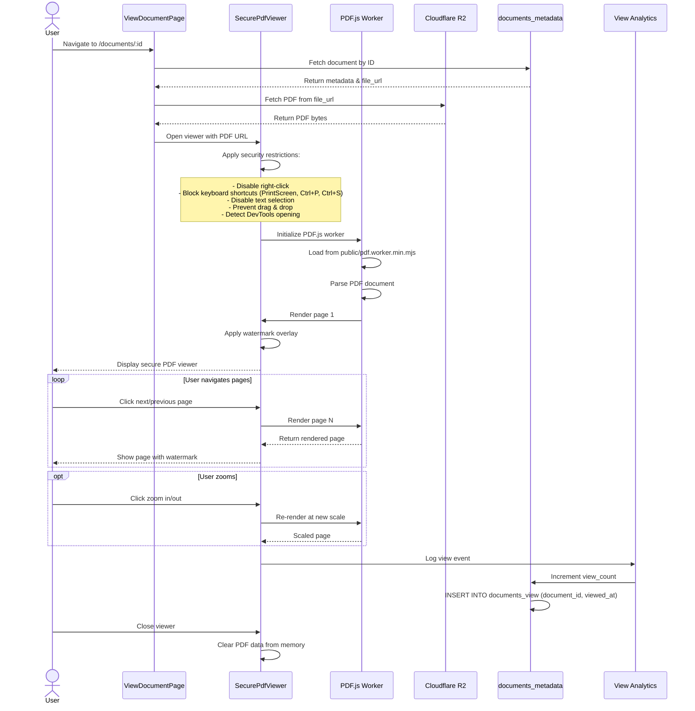
```mermaid
sequenceDiagram
    actor User
    participant UI as ViewDocumentPage
    participant SecurePDF as SecurePdfViewer
    participant PDFjs as PDF.js Worker
    participant R2 as Cloudflare R2
    participant DB as documents_metadata
    participant Analytics as View Analytics

    User->>UI: Navigate to /documents/:id
    UI->>DB: Fetch document by ID
    DB-->>UI: Return metadata & file_url
    
    UI->>R2: Fetch PDF from file_url
    R2-->>UI: Return PDF bytes
    
    UI->>SecurePDF: Open viewer with PDF URL
    SecurePDF->>SecurePDF: Apply security restrictions:
    Note over SecurePDF: - Disable right-click<br/>- Block keyboard shortcuts (PrintScreen, Ctrl+P, Ctrl+S)<br/>- Disable text selection<br/>- Prevent drag & drop<br/>- Detect DevTools opening
    
    SecurePDF->>PDFjs: Initialize PDF.js worker
    PDFjs->>PDFjs: Load from public/pdf.worker.min.mjs
    
    PDFjs->>PDFjs: Parse PDF document
    PDFjs->>SecurePDF: Render page 1
    SecurePDF->>SecurePDF: Apply watermark overlay
    SecurePDF-->>User: Display secure PDF viewer
    
    loop User navigates pages
        User->>SecurePDF: Click next/previous page
        SecurePDF->>PDFjs: Render page N
        PDFjs-->>SecurePDF: Return rendered page
        SecurePDF-->>User: Show page with watermark
    end
    
    opt User zooms
        User->>SecurePDF: Click zoom in/out
        SecurePDF->>PDFjs: Re-render at new scale
        PDFjs-->>SecurePDF: Scaled page
    end
    
    SecurePDF->>Analytics: Log view event
    Analytics->>DB: Increment view_count
    DB->>DB: INSERT INTO documents_view (document_id, viewed_at)
    
    User->>SecurePDF: Close viewer
    SecurePDF->>SecurePDF: Clear PDF data from memory
```

### 9.2 3D Artifact Viewing

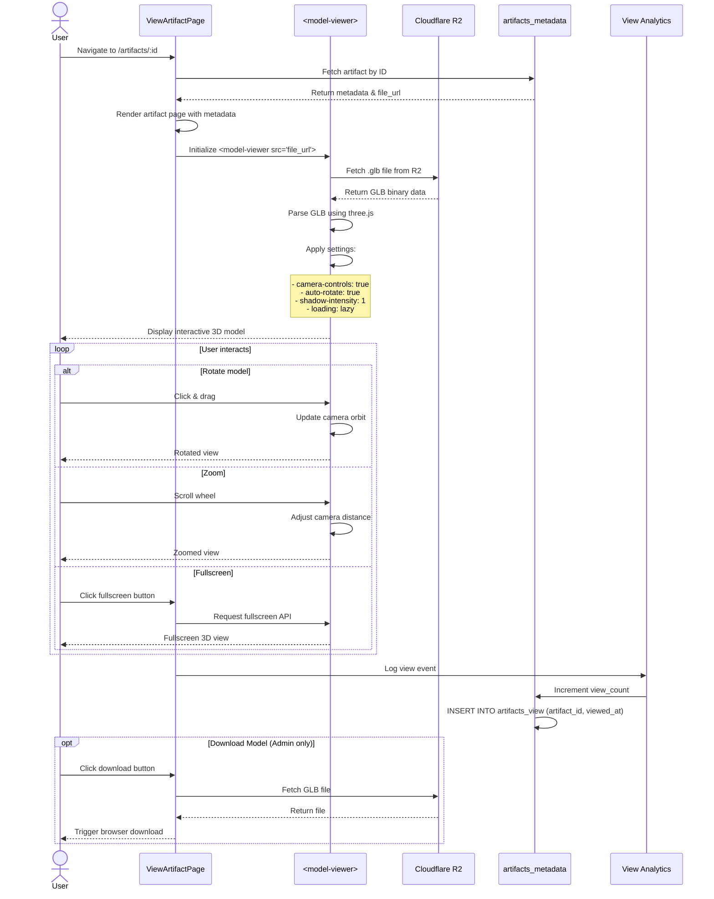
```mermaid
sequenceDiagram
    actor User
    participant UI as ViewArtifactPage
    participant ModelViewer as <model-viewer>
    participant R2 as Cloudflare R2
    participant DB as artifacts_metadata
    participant Analytics as View Analytics

    User->>UI: Navigate to /artifacts/:id
    UI->>DB: Fetch artifact by ID
    DB-->>UI: Return metadata & file_url
    
    UI->>UI: Render artifact page with metadata
    UI->>ModelViewer: Initialize <model-viewer src="file_url">
    
    ModelViewer->>R2: Fetch .glb file from R2
    R2-->>ModelViewer: Return GLB binary data
    
    ModelViewer->>ModelViewer: Parse GLB using three.js
    ModelViewer->>ModelViewer: Apply settings:
    Note over ModelViewer: - camera-controls: true<br/>- auto-rotate: true<br/>- shadow-intensity: 1<br/>- loading: lazy
    
    ModelViewer-->>User: Display interactive 3D model
    
    loop User interacts
        alt Rotate model
            User->>ModelViewer: Click & drag
            ModelViewer->>ModelViewer: Update camera orbit
            ModelViewer-->>User: Rotated view
        else Zoom
            User->>ModelViewer: Scroll wheel
            ModelViewer->>ModelViewer: Adjust camera distance
            ModelViewer-->>User: Zoomed view
        else Fullscreen
            User->>UI: Click fullscreen button
            UI->>ModelViewer: Request fullscreen API
            ModelViewer-->>User: Fullscreen 3D view
        end
    end
    
    UI->>Analytics: Log view event
    Analytics->>DB: Increment view_count
    DB->>DB: INSERT INTO artifacts_view (artifact_id, viewed_at)
    
    opt Download Model (Admin only)
        User->>UI: Click download button
        UI->>R2: Fetch GLB file
        R2-->>UI: Return file
        UI-->>User: Trigger browser download
    end
```

---

## 10. Collections Management

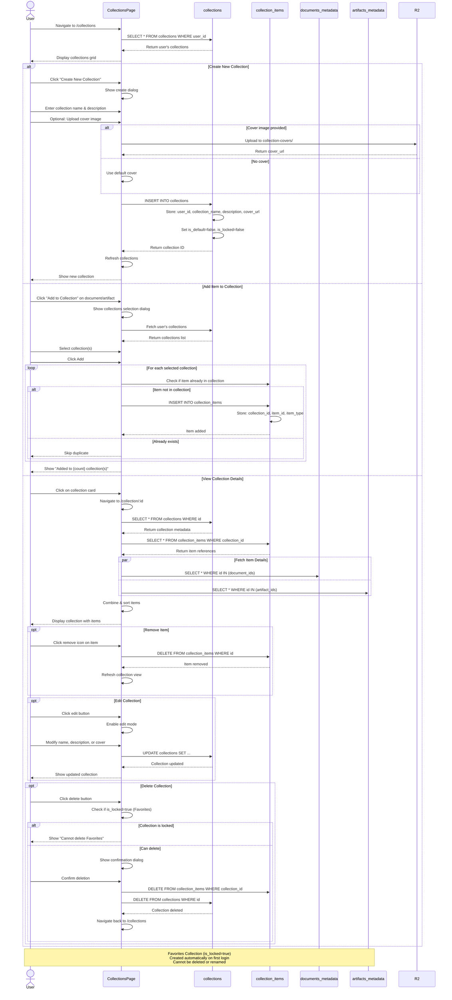
```mermaid
sequenceDiagram
    actor User
    participant UI as CollectionsPage
    participant DB as collections
    participant Items as collection_items
    participant DocDB as documents_metadata
    participant ArtDB as artifacts_metadata

    User->>UI: Navigate to /collections
    UI->>DB: SELECT * FROM collections WHERE user_id
    DB-->>UI: Return user's collections
    
    UI-->>User: Display collections grid
    
    alt Create New Collection
        User->>UI: Click "Create New Collection"
        UI->>UI: Show create dialog
        
        User->>UI: Enter collection name & description
        User->>UI: Optional: Upload cover image
        
        alt Cover image provided
            UI->>R2: Upload to collection-covers/
            R2-->>UI: Return cover_url
        else No cover
            UI->>UI: Use default cover
        end
        
        UI->>DB: INSERT INTO collections
        DB->>DB: Store: user_id, collection_name, description, cover_url
        DB->>DB: Set is_default=false, is_locked=false
        DB-->>UI: Return collection ID
        
        UI->>UI: Refresh collections
        UI-->>User: Show new collection
        
    else Add Item to Collection
        User->>UI: Click "Add to Collection" on document/artifact
        UI->>UI: Show collections selection dialog
        UI->>DB: Fetch user's collections
        DB-->>UI: Return collections list
        
        User->>UI: Select collection(s)
        User->>UI: Click Add
        
        loop For each selected collection
            UI->>Items: Check if item already in collection
            
            alt Item not in collection
                UI->>Items: INSERT INTO collection_items
                Items->>Items: Store: collection_id, item_id, item_type
                Items-->>UI: Item added
            else Already exists
                UI-->>User: Skip duplicate
            end
        end
        
        UI-->>User: Show "Added to {count} collection(s)"
        
    else View Collection Details
        User->>UI: Click on collection card
        UI->>UI: Navigate to /collection/:id
        
        UI->>DB: SELECT * FROM collections WHERE id
        DB-->>UI: Return collection metadata
        
        UI->>Items: SELECT * FROM collection_items WHERE collection_id
        Items-->>UI: Return item references
        
        par Fetch Item Details
            UI->>DocDB: SELECT * WHERE id IN (document_ids)
        and
            UI->>ArtDB: SELECT * WHERE id IN (artifact_ids)
        end
        
        UI->>UI: Combine & sort items
        UI-->>User: Display collection with items
        
        opt Remove Item
            User->>UI: Click remove icon on item
            UI->>Items: DELETE FROM collection_items WHERE id
            Items-->>UI: Item removed
            UI->>UI: Refresh collection view
        end
        
        opt Edit Collection
            User->>UI: Click edit button
            UI->>UI: Enable edit mode
            
            User->>UI: Modify name, description, or cover
            UI->>DB: UPDATE collections SET ...
            DB-->>UI: Collection updated
            UI-->>User: Show updated collection
        end
        
        opt Delete Collection
            User->>UI: Click delete button
            UI->>UI: Check if is_locked=true (Favorites)
            
            alt Collection is locked
                UI-->>User: Show "Cannot delete Favorites"
            else Can delete
                UI->>UI: Show confirmation dialog
                User->>UI: Confirm deletion
                
                UI->>Items: DELETE FROM collection_items WHERE collection_id
                UI->>DB: DELETE FROM collections WHERE id
                DB-->>UI: Collection deleted
                
                UI->>UI: Navigate back to /collections
            end
        end
    end
    
    Note over User,ArtDB: Favorites Collection (is_locked=true)<br/>Created automatically on first login<br/>Cannot be deleted or renamed
```

---

## Additional System Flows

### Password Reset Flow

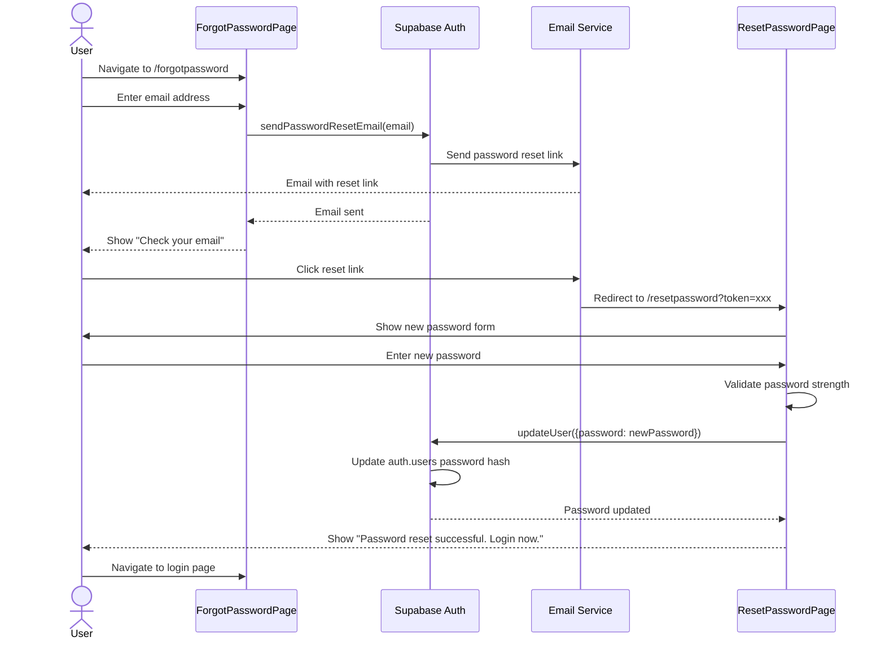
```mermaid
sequenceDiagram
    actor User
    participant UI as ForgotPasswordPage
    participant Supabase as Supabase Auth
    participant Email as Email Service
    participant ResetPage as ResetPasswordPage

    User->>UI: Navigate to /forgotpassword
    User->>UI: Enter email address
    UI->>Supabase: sendPasswordResetEmail(email)
    
    Supabase->>Email: Send password reset link
    Email-->>User: Email with reset link
    Supabase-->>UI: Email sent
    UI-->>User: Show "Check your email"
    
    User->>Email: Click reset link
    Email->>ResetPage: Redirect to /resetpassword?token=xxx
    
    ResetPage->>User: Show new password form
    User->>ResetPage: Enter new password
    ResetPage->>ResetPage: Validate password strength
    
    ResetPage->>Supabase: updateUser({password: newPassword})
    Supabase->>Supabase: Update auth.users password hash
    Supabase-->>ResetPage: Password updated
    
    ResetPage-->>User: Show "Password reset successful. Login now."
    User->>UI: Navigate to login page
```

### Session Management & Auto-Logout

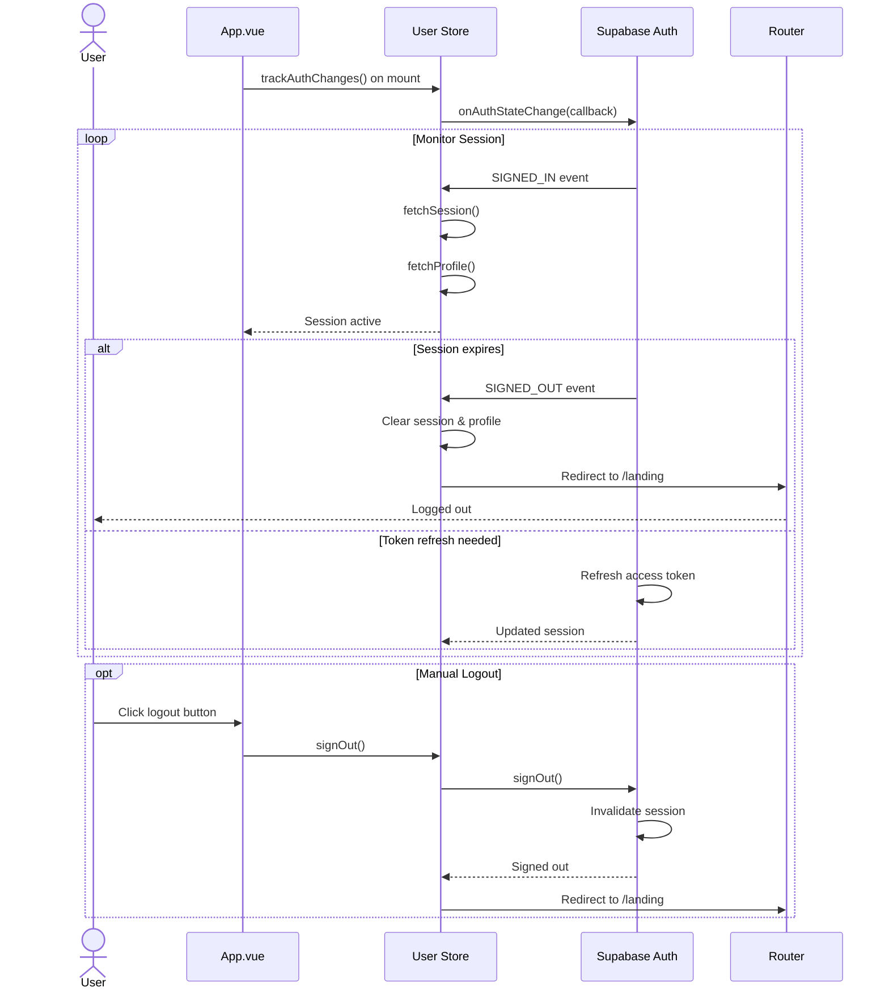
```mermaid
sequenceDiagram
    actor User
    participant App as App.vue
    participant Store as User Store
    participant Supabase as Supabase Auth
    participant Router as Router

    App->>Store: trackAuthChanges() on mount
    Store->>Supabase: onAuthStateChange(callback)
    
    loop Monitor Session
        Supabase->>Store: SIGNED_IN event
        Store->>Store: fetchSession()
        Store->>Store: fetchProfile()
        Store-->>App: Session active
        
        alt Session expires
            Supabase->>Store: SIGNED_OUT event
            Store->>Store: Clear session & profile
            Store->>Router: Redirect to /landing
            Router-->>User: Logged out
        else Token refresh needed
            Supabase->>Supabase: Refresh access token
            Supabase-->>Store: Updated session
        end
    end
    
    opt Manual Logout
        User->>App: Click logout button
        App->>Store: signOut()
        Store->>Supabase: signOut()
        Supabase->>Supabase: Invalidate session
        Supabase-->>Store: Signed out
        Store->>Router: Redirect to /landing
    end
```

---

## System Architecture Notes

### Database Triggers

The system uses several PostgreSQL triggers for maintaining data consistency:

1. **all_users table sync**: When records are inserted into `registered_users`, `registered_faculty`, `registered_admins`, or `approved_visitors`, a trigger automatically inserts corresponding records into `all_users` table
2. **account_status updates**: RPC function `update_account_status()` recalculates visitor access status based on current date vs. start/end dates
3. **view tracking**: Separate views (`documents_view`, `artifacts_view`) track document/artifact views for analytics

### Security Patterns

1. **Row Level Security (RLS)**: Supabase RLS policies ensure users can only access their own data
2. **Email Verification**: All user types require email verification before account activation
3. **Role-Based Access**: Routes protected by `requiresAuth` and `allowedRoles` meta properties
4. **Super Admin Protection**: Additional `is_super_admin` flag check for sensitive operations
5. **Secure PDF Viewing**: Custom viewer component prevents copying, printing, and screenshots

### Performance Optimizations

1. **Lazy Loading**: Images and 3D models loaded on-demand
2. **Pagination**: Large lists use client-side pagination (Quasar q-table)
3. **Search Indexing**: Full-text search on `search_text` column in metadata tables
4. **PDF Compression**: Documents compressed before upload to reduce storage
5. **Image Previews**: First page of PDFs converted to thumbnails for fast gallery loading

---

## Diagram Legend

- **Actor**: User initiating the action (Student, Admin, Visitor, etc.)
- **Participant**: System component handling logic
- **Solid Arrow (→)**: Synchronous call/action
- **Dashed Arrow (-->)**: Response/return
- **alt/else**: Conditional logic branches
- **opt**: Optional operation
- **par**: Parallel operations
- **loop**: Repeated operations
- **Note**: Additional context or explanation

---

**Document Version**: 1.0  
**Last Updated**: 2025-01-12  
**System**: PRESERV3D - PUP Library Archive Management  
**Tech Stack**: Quasar (Vue 3) + Supabase + Python FastAPI + Cloudflare R2
